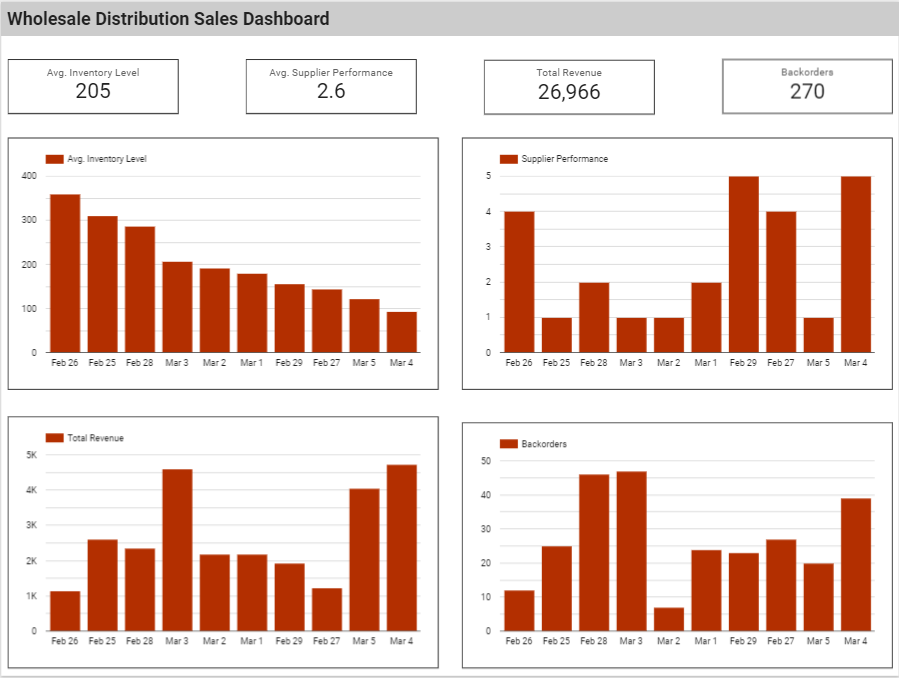

## Excel_Wholesale_Distribution_Sales_Dashboard

## Overview
This repository contains a collection of Excel Pivot Dashboards designed to provide powerful insights from raw datasets. Each dashboard leverages Excel's PivotTable and PivotChart features to create dynamic, interactive, and visually appealing data summaries. These dashboards are ideal for users looking to streamline their data analysis, identify trends, and communicate key insights effectively.
## Features
- Interactive PivotTables: Easily filter, sort, and analyze large datasets with PivotTables.
- Visualizations: PivotCharts included for visual representation of data, offering clear insights into trends, distributions, and comparisons.
- User-friendly Interface: Dashboards designed for ease of use, enabling users to interact with the data without needing advanced Excel knowledge.
- Data Slicers: Simplify data filtering with easy-to-use slicers for quick analysis of specific data segments.
- Dynamic Updates: Dashboards automatically update when data is refreshed, making it ideal for recurring reports.
## Contents
This repository includes:
- Dashboard Files: Excel files containing different Pivot Dashboards focused on various scenarios and use cases.
- Sample Data: Datasets used for generating the dashboards, showcasing data from multiple domains.
- Documentation: Descriptions of each dashboard with details on how to interact with them and what insights they provide.
## How to Use
1. Download the desired Excel file from the repository.
2. Open the file in Microsoft Excel.
3. Interact with the PivotTables and PivotCharts by using slicers and filters to explore the data.
4. For datasets that are regularly updated, simply refresh the data source to see the dashboard automatically adjust to reflect the new data.
## Prerequisites
- Microsoft Excel: Version 2016 or later is recommended for optimal functionality.
- Basic Excel Knowledge: Understanding of Excel formulas, PivotTables, and PivotCharts is useful but not required.
## Contact
For any questions or suggestions, feel free to reach out:
- GitHub: Sanchit Goel
- Email: goelsanchit29@gmail.com